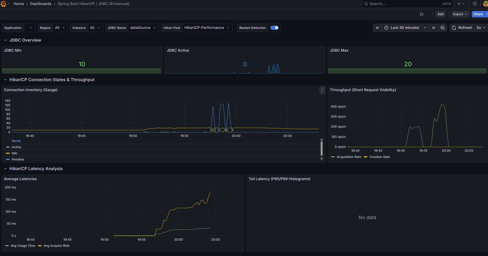

# HikariCP  지표 

##  JDBC Overview

연결 풀(Connection Pool)의 기본적인 설정 및 상태 값

- **JDBC Min**: 풀에서 유지하려는 최소 연결 수, 현재 10으로 설정
- **JDBC Active**: 현재 애플리케이션이 사용 중인 실제 연결 수
- **JDBC Max**: 풀이 생성할 수 있는 최대 연결 수, 현재 20으로 설정

## HikariCP Connection States & Throughput

연결의 상태 변화와 처리량을 세부적으로 나타냄

- **Connection Inventory**
  - **Active**
    - 현재 쿼리를 실행 중이거나 트랜잭션에 점유된 연결
  - **Idle**
    - 풀 내에 대기 중이며 즉시 사용 가능한 유휴 연결
  - **Pending**
    - 연결을 사용하기 위해 대기 중인 스레드 수
    - 그래프상 20:00 부근에서 파란색 선이 튀어 오르는 것은 스레드가 연결을 즉시 얻지 못하고 기다렸음을 의미
- **Throughput**
  - **Acquisition Rate**
    - 초당 풀에서 연결을 빌려가는 빈도
    - 피크 시점에 400 ops/s를 넘음
  - **Creation Rate**
    - 새로운 물리 연결이 생성되는 빈도

## HikariCP Latency Analysis

성능 병목을 파악하는 지표

- **Avg Usage Time**
  - 연결을 빌려간 후 반납할 때까지의 평균 시간(비즈니스 로직 처리 + 쿼리 실행 시간)
- **Avg Acquire Wait**
  - 스레드가 풀에서 연결을 획득하기 위해 대기한 평균 시간
  - 19:57 이후 이 수치가 급증했다는 것은 연결 풀의 크기(Max 20)가 유입 트래픽을 처리하기에 부족했음을 나타냄
