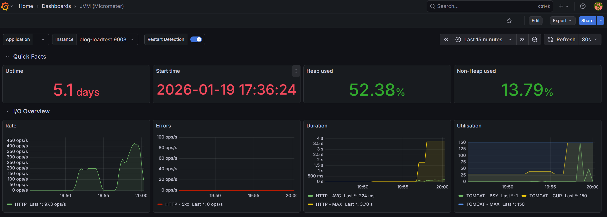
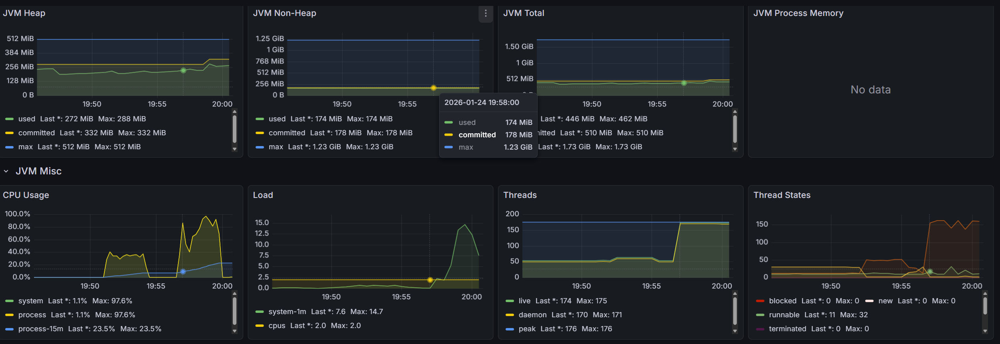
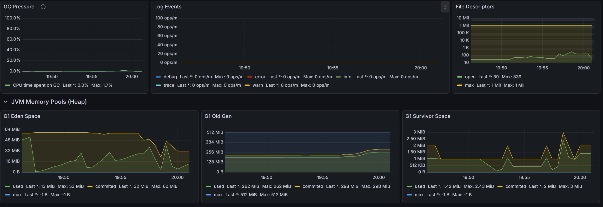
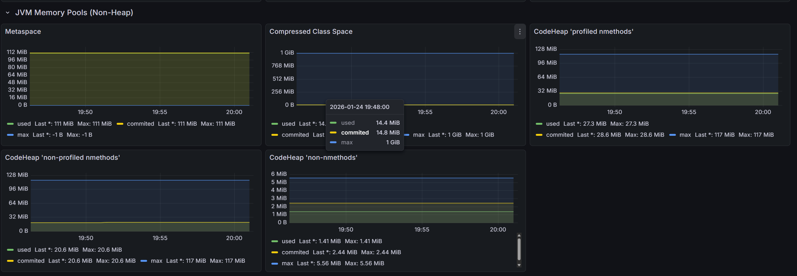
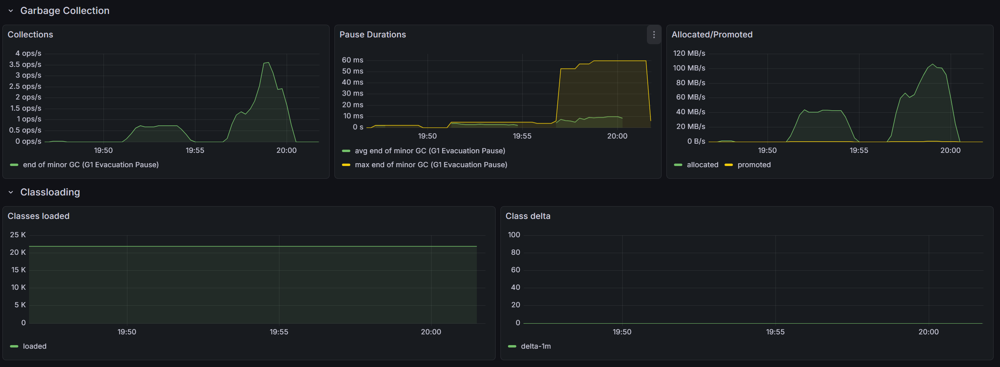
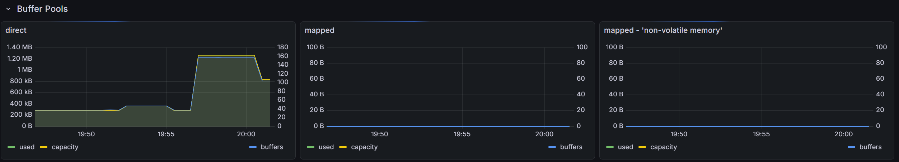

# JVM 지표 관련

---

## Quick Facts

- **Uptime**
  -  JVM 프로세스가 구동된 후 경과된 총 시간. 시스템의 지속 가동 능력 및 최근 재시작 여부를 확인하는 지표.

- **Start time**
  - 애플리케이션이 최종적으로 시작된 시점.

- **Heap used**
  - JVM 메모리 중 객체가 동적으로 할당되는 힙(Heap) 영역의 사용 비율. 
  - 가비지 컬렉션(GC)의 효율성과 메모리 누수 여부를 판단하는 핵심 지표.

- **Non-Heap used**
  - 클래스 메타데이터, 메서드 데이터, 코드 캐시 등 JVM 구동에 필요한 정적 데이터가 저장되는 영역의 사용 비율.

## I/O Overview

- **Rate (HTTP ops/s)**
  - 초당 처리되는 HTTP 요청 수(Throughput)
  - 현재 시스템이 감당하고 있는 트래픽의 양을 의미함.

- **Errors (HTTP - 5xx)**
  - 서버 내부 오류로 인해 실패한 요청의 빈도
  - 서비스의 안정성과 신뢰도를 직접적으로 나타냄

- **Duration (HTTP - AVG/MAX)**
  - 요청 처리에 소요된 시간(Latency)
  - 평균(AVG)은 전반적인 사용자 경험을, 최대값(MAX)은 특정 요청에서 발생하는 병목이나 튀는 현상(Outlier)을 파악하는 데 사용됨.
  
- **Utilisation (TOMCAT)**: WAS(Tomcat)의 스레드 풀 사용 현황.
  - **BSY (Busy)**
    - 현재 요청을 처리 중인 활성 스레드 수.
  - **CUR (Current)**
    - 현재 생성되어 있는 총 스레드 수.
  - **MAX**
    - 설정된 최대 스레드 제한치. 이 수치에 도달하면 추가 요청은 큐에서 대기하게 됨.

## 메모리 지표 (JVM Heap, Non-Heap, Total)

- **used**
  - 현재 실제 객체나 데이터가 점유하고 있는 메모리 양.

- **committed**
  - JVM이 운영체제(OS)로부터 즉시 사용 가능하도록 할당받아 보장된 메모리 양.

- **max**
  - JVM이 사용할 수 있도록 설정된 최대 메모리 한도.
  - `used`가 이 수치에 도달하면 OutOfMemoryError가 발생할 수 있음.
    - 소위 OOM

- **JVM Total**
  - Heap과 Non-Heap을 합산한 전체 JVM 메모리 사용 현황.

------

## 시스템 자원 및 부하 (JVM Misc)

Miscellaneous - 내가 아는 그 Misc 맞음

- **CPU Usage**
  - **system**
    - 장비 전체(OS 수준)의 CPU 사용률
      - 좀 애매해 보임, 그냥 전체 spring + tomcat 할당량에 대한 사용량 같음
    - process 랑 거의 겹쳐서 잘 안보이는 듯 
  - **process**
    - 해당 JVM 프로세스(애플리케이션)가 점유하고 있는 CPU 사용률.
- **Load**:
  - **system-1m**
    - 최근 1분간 실행 대기 중인 프로세스의 평균 수.
  - **cpus**
    - 현재 시스템에 할당된 전체 CPU 코어 수
      - 이거 cgroup 값이랑 다르게 나옴
      - 나중에 다시 할일 있으면 한번 더 보기
    - `system-1m`이 이 수치보다 높으면 CPU 병목이 발생하고 있음을 의미.

------

## 스레드 현황

- **live**
  - 현재 작동 중인 총 스레드 수 (Daemon + Non-Daemon).

- **daemon**
  - 백그라운드에서 실행되는 데몬 스레드 수.

- **peak**
  - JVM 구동 이후 기록된 최대 스레드 수.

- **Thread States**: 스레드의 현재 상태별 분포.
  - **runnable**
    - CPU를 점유하여 실행 중이거나 실행 가능한 상태.
  - **blocked**
    - 모니터 락(Lock)을 획득하기 위해 대기 중인 상태.
  - **waiting/timed_waiting**
    - 특정 조건이나 시간 동안 대기 중인 상태

## GC Pressure

- 전체 CPU 사용량 중 가비지 컬렉션(GC) 작업이 차지하는 비중
- 현재 최대치 1.7%로, GC로 인한 CPU 부하가 매우 낮은 상태

## Log Events

- 애플리케이션에서 발생하는 로그 레벨별(Error, Warn, Info 등) 빈도

- 특정 시점에 Error나 Warn 수치가 급증하면 로직 상의 문제를 즉시 파악 가능

- **File Descriptors**: JVM 프로세스가 열고 있는 파일 및 네트워크 소켓의 개수
  - 시스템 한도(Max)에 도달하면 'Too many open files' 에러가 발생하며 서버가 중단 가능

### JVM Memory Pools (G1 GC 기준)

- **G1 Eden Space**
  - 새로 생성된 객체가 할당되는 영역
  - 그래프가 톱니바퀴 모양으로 급격히 떨어지는 지점은 Young GC가 수행되어 메모리가 비워진 시점을 의미

- **G1 Old Gen**
  - Young GC에서 살아남아 장기간 참조되는 객체가 머무는 영역
  - 그래프가 계단식으로 계속 우상향하고 떨어지지 않는다면 메모리 누수(Memory Leak)를 의심

- **G1 Survivor Space**
  - Eden에서 살아남은 객체가 Old Gen으로 넘어가기 전 임시로 저장되는 완충 영역
  - 객체의 Age(생존 횟수)를 관리하며 메모리 단편화를 방지

## Metaspace

- 클래스의 구조 정보(메타데이터)를 저장하는 공간
- Java 8부터 도입, 애플리케이션에 로드된 클래스 수에 비례하여 사용량이 결정

## Compressed Class Space

- 64비트 JVM에서 메모리 효율을 높이기 위해 클래스 포인터를 압축하여 저장하는 별도 공간

## CodeHeap 'profiled nmethods'

- JIT 컴파일러가 최적화를 위해 프로파일링 정보를 포함하여 컴파일한 코드를 저장
- 주로 'Hot Method'라 불리는 자주 호출되는 코드들이 위치

## CodeHeap 'non-profiled nmethods'

- 최적화가 완료되어 더 이상의 프로파일링이 필요 없는 완전한 형태의 네이티브 코드가 저장

## CodeHeap 'non-nmethods'

- 컴파일된 코드가 아닌, 컴파일러 자체의 제어 구조나 중간 데이터 등 관리 작업에 필요한 정보들이 저장

## Garbage Collection & Classloading

애플리케이션의 런타임 성능과 직접적으로 연결되는 지표

### Garbage Collection

- **Collections**
  - 초당 발생하는 GC 횟수
  - 객체 생성이 많았음을 시사

- **Pause Durations**
  - GC 작업으로 인해 애플리케이션이 멈추는 시간(Stop-The-World)
  - 그래프에서 최대 멈춤 시간(Max)이 약 50ms 이상으로 튄 지점이 확인

- **Allocated/Promoted**
  - **Allocated**는 새로 할당된 객체의 양
  - **Promoted**는 Young 영역에서 Old 영역으로 승격된 객체의 양을 의미

### Classloading

- **Classes loaded**
  - 현재 JVM에 로드되어 있는 클래스의 총 개수
  - 약 23,000개 수준에서 일정하게 유지
    - K == 1000 인듯

- **Class delta**
  - 특정 시간 동안 새로 로드되거나 제거(Unload)된 클래스 수의 차이
  - 현재 '0'에 수렴하므로 클래스 동적 로딩이 거의 없는 상태

## Buffer Pools

- Java NIO 등에서 사용하는 커널 영역과의 직접적인 데이터 주고받기를 위한 메모리
  - 사실 아직 잘 모르겟음

- **direct**
  - `ByteBuffer.allocateDirect()` 등을 통해 할당된 메모리
    -  19:57분경부터 사용량이 약 1.2MB로 4배가량 급증했는데, 이는 네트워크 I/O나 파일 처리가 증가했음을 시사

- **mapped**
  - 설정된 메모리 매핑 파일 관련 지표이며, 현재는 사용되지 않고 있음

