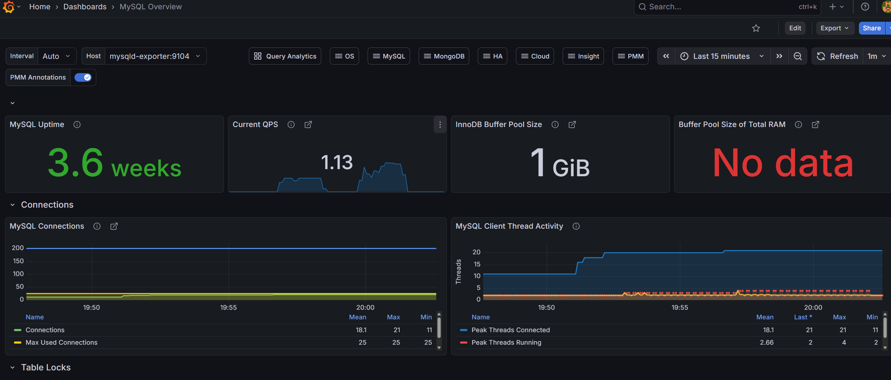
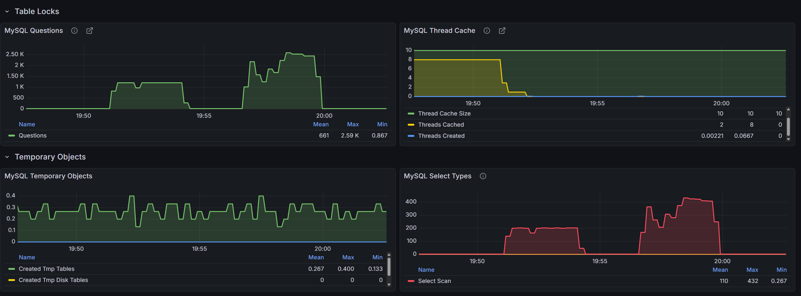
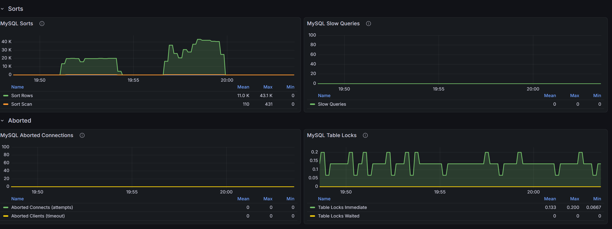
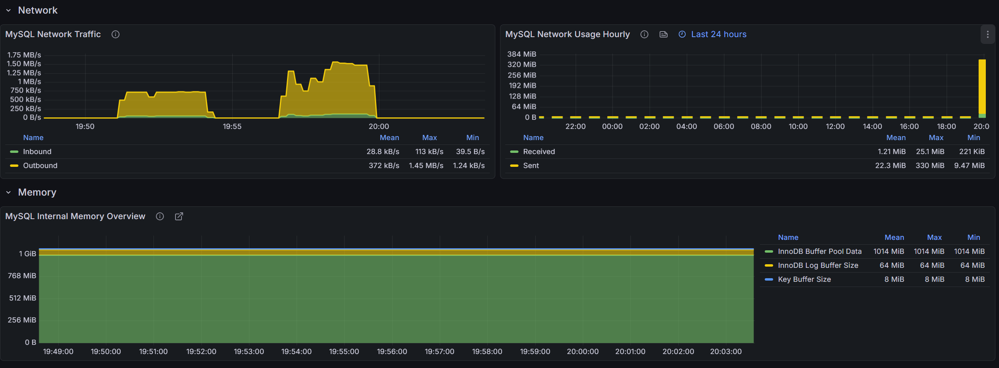
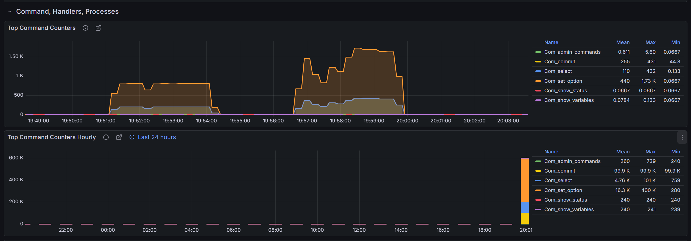
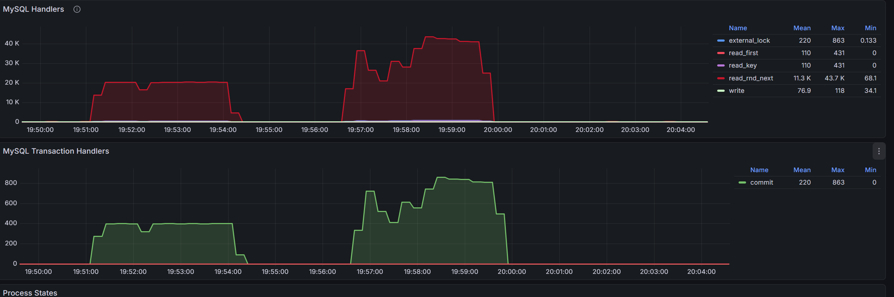
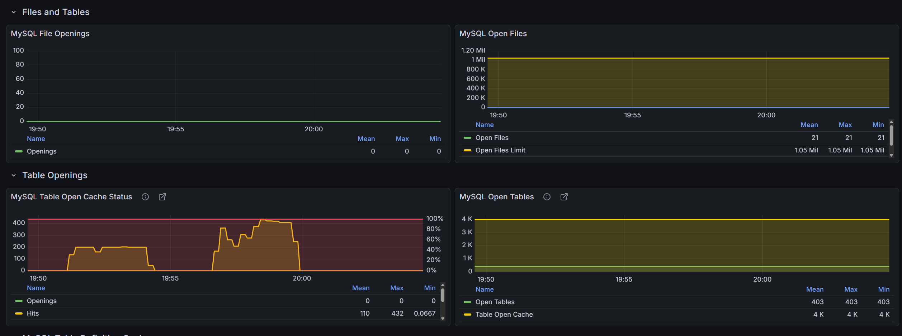
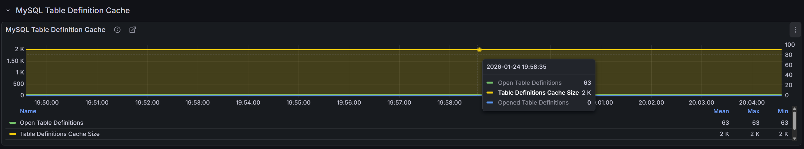

## mysql 지표 관련

### 주요 상태 지표

- **MySQL Uptime**
  - MySQL 서버가 마지막으로 재시작된 이후 가동된 시간
- **Current QPS**
  - 초당 처리되는 쿼리 수(Queries Per Second)
  - 현재 데이터베이스의 처리량(Throughput)을 나타냄
- **InnoDB Buffer Pool Size**
  - InnoDB 스토리지 엔진이 데이터와 인덱스를 캐싱하기 위해 사용하는 메모리 크기
  - DB 성능에 직접적인 영향을 주는 설정값

## Connections

- 근데 Hikari CP 도 그렇고 이런 connnection 같은 지표는 잘 안찍히는 듯 
  - 다음에 할땐 로그 위주로 하는 게 좋을듯, connnection 관련해선
  - 아님 다른 방식 생각해보기                                                                     

- **MySQL Connections**
  - 현재 데이터베이스에 연결된 세션 수를 보여줌
    - 사실  세션이라고 표현하긴 하는 데 4계층 성격이 좀 강해보임
    - 아닐수도 
  
  - **Connections**
    - 현재 실시간으로 연결된 세션 수
  
  - **Max Used Connections**
    - 서버 시작 이후 도달했던 최대 동시 연결 수
    - 설정된 `max_connections` 값과 비교하여 임계치 도달 여부를 판단
  

## MySQL Client Thread Activity 

- **Peak Threads Connected**
  - 특정 시점에 가장 많이 연결되었던 스레드의 수

- **Peak Threads Running**
  - 실제로 쿼리를 실행 중인(Active) 스레드의 수                                                                                
  - 이 수치가 급증하면 CPU 병목이나 잠금(Lock) 경합을 의심 필요

## MySQL Questions

K == 1000 인듯

- **Questions**
  - 서버가 클라이언트로부터 수신하여 실행한 모든 구문(Statement)의 총 횟수
  - 서버의 전체적인 작업 부하(Workload) 수준을 파악하는 기본 지표

| **구분**      | **Questions**                | **Transactions**                |
| ------------- | ---------------------------- | ------------------------------- |
| **측정 단위** | 개별 SQL 문장 수             | 논리적 작업 완료 수             |
| **포함 관계** | **N개** (다수)               | **1개** (단일)                  |
| **성격**      | 시스템 처리량(Throughput)    | 비즈니스 처리량                 |
| **관련 지표** | `QPS` (Questions Per Second) | `TPS` (Transactions Per Second) |

## MySQL Thread Cache

- `이거 책에서 봤던 그거`

- Percona 였나 그거 쓰면 pool 로 설정 가능 (아마도)

- **Thread Cache Size**
  - 새로운 연결 요청 시 재사용하기 위해 메모리에 보관할 수 있는 최대 스레드 개수

- **Threads Cached**
  - 현재 캐시에 보관되어 있는 유휴(Idle) 상태의 스레드 수

- **Threads Created**
  - 캐시에 적재된 스레드가 없어 서버가 새로 생성한 스레드 수
  - 이 수치가 지속적으로 높다면 연결 오버헤드를 줄이기 위해 `thread_cache_size` 상향을 검토

## MySQL Temporary Objects

- **Created Tmp Tables**
  - 복잡한 쿼리(GROUP BY, DISTINCT 등)를 처리하기 위해 메모리에 생성된 임시 테이블 수

- **Created Tmp Disk Tables**
  - 메모리 내 임시 테이블 크기 제한을 초과하여 디스크에 작성된 임시 테이블 수
  - 디스크 I/O를 유발하여 성능 저하의 원인이 되므로
    - 수치가 높을 경우 쿼리 튜닝이나 관련 메모리 설정 확인이 필요

## MySQL Select Types

- **Select Scan**
  - 인덱스를 사용하지 못하고 테이블 전체를 읽는 **Full Table Scan**이 발생한 횟수
  - 현재 그래프에서 특정 시점에 수치가 급증한 것은 효율적이지 못한 쿼리가 대량으로 실행되었음을 시사

## MySQL Sorts (정렬 작업)

정렬 작업의 효율성을 나타내는 지표

- **Sort Rows**
  - 정렬된 총 행의 수
  - 현재 그래프에서 수치가 높게 나타나는 것은 `ORDER BY`나 `GROUP BY` 작업 시 많은 데이터를 정렬하고 있음을 의미

- **Sort Scan**
  - 테이블 스캔을 통해 수행된 정렬 횟수
  - 인덱스를 활용하지 못하고 데이터를 직접 읽어 정렬할 때 수치가 상승
  - 과도할 경우 인덱스 최적화가 필요

## MySQL Slow Queries (느린 쿼리)

시스템 성능에 부하를 주는 쿼리를 식별하는 지표

- **Slow Queries**
  - `long_query_time` 설정값보다 실행 시간이 오래 걸린 쿼리의 개수

## MySQL Aborted Connections (중단된 연결)

데이터베이스 연결의 안정성을 나타내는 지표

- **Aborted Connects (attempts)**
  - MySQL 서버에 연결을 시도했으나 실패한 횟수
  - 주로 잘못된 비밀번호나 권한 문제, 네트워크 오류 시 발생

- **Aborted Clients (timeout)**
  - 클라이언트가 연결을 적절히 닫지 않고 비정상적으로 종료된 횟수
  - 네트워크 단절이나 클라이언트 측의 타임아웃 설정을 점검해야 할 때 참고

### MySQL Table Locks (테이블 잠금)

데이터 일관성을 위한 잠금 장치의 경합 상태를 보여줌

- **Table Locks Immediate**
  - 즉시 획득된 테이블 잠금 횟수
  - 주로 MyISAM 엔진이나 특정 DDL 작업 시 발생하며, 현재 수치가 존재하지만 즉시 처리

- **Table Locks Waited**
  - 잠금을 획득하기 위해 대기한 횟수
  - 이 수치가 높으면 쿼리 간 병목 현상이 심각하다는 뜻인데, 현재 '0'이므로 잠금으로 인한 지연은 없음

## MySQL Network Traffic

서버에 드나드는 실시간 네트워크 대역폭 사용량을 나타냄

- **Inbound**
  - 클라이언트(애플리케이션)가 MySQL 서버로 보낸 데이터 양
  - 주로 쿼리 요청 메시지가 이에 해당

- **Outbound**
  - MySQL 서버가 클라이언트로 보낸 데이터 양
  - 쿼리 실행 결과 데이터가 포함되므로 보통 Inbound보다 수치가 높게 나타남

## MySQL Network Usage Hourly

최근 24시간 동안의 네트워크 사용량을 시간 단위로 합산한 통계

- **Received / Sent**
  - 각각 시간당 수신/송신된 전체 데이터양을 의미
  - 특정 시간대에 트래픽이 몰리는지 확인하여 서비스의 피크 타임을 파악하는 데 용이

## MySQL Internal Memory Overview

MySQL 엔진 내부에서 할당하여 사용 중인 주요 메모리 영역의 크기를 보여줌

- **InnoDB Buffer Pool Data**
  - 인덱스와 테이블 데이터를 캐싱하기 위한 가장 중요한 메모리 영역
  - 현재 약 **1,014 MiB**로 설정되어 있으며, 이 값이 클수록 디스크 I/O가 줄어들어 성능이 향상

- **InnoDB Log Buffer Size**
  - 트랜잭션 로그(Redo Log)를 디스크에 기록하기 전 임시로 저장하는 공간
  - 현재 **64 MiB**로 설정
    - 대용량 트랜잭션 처리 시 디스크 쓰기 부하를 조절하는 역할
  
- **Key Buffer Size**
  - 애매
    - 나중에 찾아보기
  
  - MyISAM 테이블의 인덱스를 캐싱하는 영역
  - 현재 **8 MiB**로 매우 작게 설정되어 있는데, 이는 주로 InnoDB 엔진을 사용하고 있음을 시사
  

## Top Command Counters (실시간 명령 통계)

- **Com_set_option**
  - **세션 설정 및 옵션 변경** 명령의 실행 횟수임
  - 현재 지표 중 최대 1.73 K로 가장 빈번하게 발생

- **Com_select**
  - **SELECT** 쿼리를 통한 데이터 조회 횟수
  - 최대 432회를 기록하며 전반적인 조회 부하를 나타냄.

- **Com_commit**
  - **트랜잭션 확정 명령**의 실행 횟수
  - 최대 431회로 SELECT와 비슷한 빈도로 발생하며 데이터 변경 작업이 활발함을 의미함.

- **Com_admin_commands**
  - 서버 관리와 관련된 관리용 명령 실행 횟수임.

- **Com_show_status / Com_show_variables**
  - 서버의 상태나 설정값을 조회하는 명령 실행 횟수임.

## MySQL Handlers

MySQL 엔진이 스토리지 엔진(InnoDB 등)에 데이터 읽기/쓰기를 요청할 때 발생하는 Handler API 호출 지표

- **read_rnd_next**
  - 데이터 파일에서 다음 행을 읽을 때 발생 현재 그래프에서 가장 높은 수치를 보임
  - 이는 **Full Table Scan(전체 테이블 스캔)**이 빈번하게 일어나고 있음을 시사
  - 인덱스를 타지 못하는 쿼리가 많을 때 급증
    -  근데 부하 쿼리가 인덱스 탈 필요가 없는 쿼리라 상관 없을듯

- **read_key**
  - 인덱스를 사용하여 특정 행을 직접 읽을 때 발생
  - 현재 수치가 매우 낮아, 인덱스를 활용한 효율적인 조회가 거의 이루어지지 않고 있음

- **read_first**
  - 인덱스의 첫 번째 항목을 읽는 횟수입니다. 주로 인덱스 전체 스캔(Full Index Scan) 시 발생

- **write**
  - 데이터가 삽입(INSERT)될 때 발생

- **external_lock**
  - 테이블에 락(Lock)을 거는 횟수

## MySQL Transaction Handlers

트랜잭션 처리와 관련된 지표

- **commit**
  - 트랜잭션이 최종적으로 확정(COMMIT)된 횟수
  - 그래프상에서 `read_rnd_next`가 치솟는 시점과 동일하게 `commit` 수치(Max 863)가 상승하는 것으로 보아, 특정 트랜잭션 내에서 대량의 데이터를 스캔하는 작업이 수행되고 있음을 알 수 있음

## Files 관련 지표

운영체제 레벨에서 MySQL이 파일을 얼마나 열고 관리하는지를 나타냅니다.

- **MySQL File Openings**
  - 서버가 시작된 이후 데이터 파일이나 로그 파일을 새로 연 횟수(`opened_files`)
  - 현재 **0**으로 표시되는 것은 새로운 파일을 열지 않고 이미 열려 있는 파일 핸들을 안정적으로 재사용하고 있음을 의미
    - 지표 같은 건 이미 열려있는 파일이라고 함
      - 순수 *open()* 횟수라고 함

- **MySQL Open Files**
  - **Open Files**
    - 현재 MySQL 엔진에 의해 열려 있는 실제 파일의 수
  - **Open Files Limit**
    - MySQL이 최대로 열 수 있도록 설정된 파일 수 제한
    - (현재 **1.05M**, 즉 약 105만 개) 설정값에 비해 실제 사용량이 매우 적어 파일 핸들 부족 문제는 없는 상태

## Table Openings 관련 지표

메모리 내의 테이블 캐시 효율성을 나타내는 지표

- **MySQL Table Open Cache Status**
  - **Hits**
    - 쿼리 수행 시 필요한 테이블 정보가 메모리(Table Open Cache)에 이미 존재하여 즉시 사용한 횟수
  - **Openings**
    - 테이블 캐시에 정보가 없어 디스크에서 테이블 정보를 새로 읽어온 횟수
- **MySQL Open Tables**
  - **Open Tables**
    - 현재 메모리에 캐시되어 열려 있는 테이블의 총 개수
  - **Table Open Cache**
    - 테이블 캐시가 최대로 수용할 수 있는 설정값
    - 현재 **4K**, 즉 4,096개, 현재 403개만 사용 중이므로 캐시 공간이 충분히 여유

## MySQL Table Definition Cache

이 지표는 MySQL이 테이블의 **메타데이터(스키마 정보)**를 메모리에 보관하여 관리하는 효율성을 보여줌

- **Table Definition Cache 개요**
  - 테이블의 구조 정보(컬럼명, 데이터 타입, 인덱스 구성 등)를 저장하는 메모리 영역
  - 쿼리 실행 시 매번 디스크에서 테이블 정의 파일(.frm 등)을 읽지 않도록 하여 응답 속도를 높임
- **Open Table Definitions**
  - 현재 메모리(캐시)에 로드되어 있는 고유한 테이블 정의의 개수
  - 서버 실행 후 한 번이라도 접근했던 서로 다른 테이블의 총 개수를 의미
- **Table Definitions Cache Size**
  - 메모리에 저장할 수 있는 테이블 정의의 최대 개수 설정값
  - 현재 2,000개로 설정되어 있으며, 이 수치가 실제 사용량보다 작으면 기존 캐시를 삭제하고 디스크에서 다시 읽어오는 부하가 발생
- **Opened Table Definitions**
  - 캐시에 해당 테이블 정의가 없어서 디스크에서 직접 읽어온 누적 횟수
  - 서버 기동 직후를 제외하고 이 수치가 지속적으로 증가한다면 설정된 캐시 크기가 부족하다는 증거
