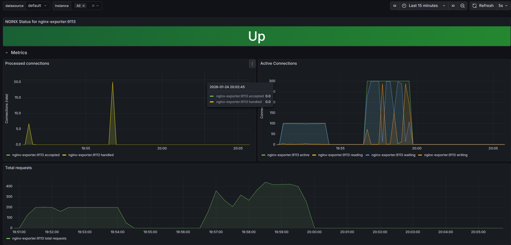

# nginx exporter 지표 관련

## Processed connections

- 이 지표 새로 연결된 TCP 사이 지표만 나오는 듯
  - 물리적 새 연결이 생성될때

- NGINX가 클라이언트의 연결 요청을 어떻게 처리했는지 나타내는 비율 지표

- **Accepted (수락됨)**: NGINX 서버가 클라이언트로부터 수락한 총 연결 횟수
- **Handled (처리됨)**: 수락된 연결 중 실제로 처리가 완료된 연결 횟수
  - 일반적으로 Accepted와 Handled의 수치는 일치 해야 함
  - 두 수치에 차이가 발생한다면 자원 부족(Worker Connections 제한 등)으로 인해 연결이 드롭되었음을 의미
    - handled 지표가 더 높을 수 없음

## Active Connections

현재 NGINX가 유지하고 있는 연결의 실시간 상태를 세분화하여 나타냄

- **Active** (해당 지표 총합 값 느낌)
  - 현재 열려 있는 모든 클라이언트 연결의 **총합**
  - 여기에는 아래의 Reading, Writing, Waiting 상태가 모두 포함

- **Reading**
  - NGINX가 클라이언트로부터 요청 헤더(Request Header)를 읽고 있는 연결 수
  - 이 수치가 높다면 클라이언트의 네트워크 속도가 느리거나 대량의 요청이 유입되고 있음을 시사

- **Writing**
  - NGINX가 클라이언트에게 응답을 전송하고 있거나, 요청 본문(Body)을 읽고 있는 연결 수
  - 보통 연산이나 데이터 전송이 일어나는 단계
  - 이 상황에 한해서 Spring 에서의 요청을 기다리는 것도 이 지표에 포함되는 듯
    - Spring 응답 대기
  
- **Waiting**
  - Keep-alive 모드로 인해 다음 요청을 기다리며 유휴(Idle) 상태에 있는 연결 수

## Total requests (총 요청 수)

서버가 가동된 이후 처리한 전체 HTTP 요청의 누적치 또는 단위 시간당 요청률을 나타냄

- **Total requests**: 클라이언트에서 보낸 전체 요청 횟수
  - **Connection vs Request**
    - 하나의 연결(Connection)을 통해 여러 개의 요청(Request)이 처리될 수 있으므로, 일반적으로 이 수치는 Processed connections보다 높게 나타남

## 상단 상태 바 (NGINX Status)

- **Up (그린 바)**
  - *DOWN*시 붉은 색

