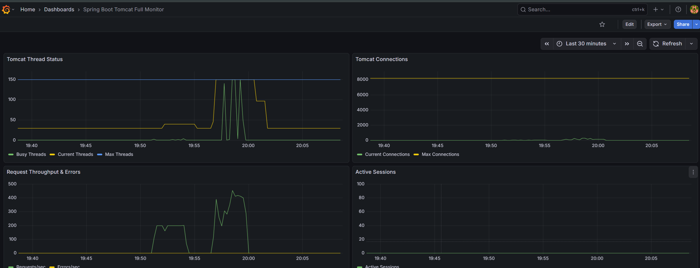

## metrics

## Tomcat Thread Status (스레드 상태)

- **Max Threads**
  - 톰캣이 생성할 수 있는 최대 스레드 개수
  - 수치에 도달하면 추가 요청은 큐에서 대기
- **Current Threads**
  - 현재 톰캣이 생성하여 유지하고 있는 총 스레드 수입니다. 유휴(Idle) 스레드와 실행 중인 스레드를 모두 포함
- **Busy Threads**
  - 현재 요청을 실제로 처리 중인 스레드 수

## Tomcat Connections (연결 상태)

서버에 연결된 TCP 커넥션 수를 나타냄

- **Max Connections**
  - 서버가 동시에 허용할 수 있는 최대 커넥션 수입니다. 현재 약 8,000으로 설정되어 있어 자원이 매우 넉넉한 편
- **Current Connections**
  - 현재 서버와 클라이언트 간에 맺어져 있는 실제 커넥션 수

## Request Throughput & Errors (처리량 및 에러)

초당 처리되는 요청 수와 에러 발생률을 나타냄

- **Requests/sec (TPS)**
  - 초당 처리되는 HTTP 요청 횟수입니다. 20:00경에 약 450 TPS까지 치솟았으며, 이는 'Tomcat Thread Status'의 Busy Threads 급증 시점과 정확히 일치

- **Errors/sec**
  - 초당 발생하는 에러(5xx 등) 수
  - 그래프상 바닥에 붙어 있는 것으로 보아, 부하가 걸린 상황에서도 애플리케이션이 에러를 내뱉지 않고 정상적으로 응답을 처리했음을 알 수 있음

#### Active Sessions (활성 세션)

서버 메모리에 상주하며 관리되는 사용자 세션의 수

- **Active Sessions**
  - 현재 0에 가깝게 유지되고 있음
  - 해당 애플리케이션이 세션을 사용하지 않는 Stateless 방식(REST API 등)이거나
  - JWT 같은 토큰 기반 인증을 사용하고 있음
    - 근데 이거 tomcat 도 세션 관리 가능한가 봄
    - 나중에 찾아보기

---

# 기타 내용

- 나중에 생각해 보기
  - 아직 생각  X

## tomcat 관련 추가 설명

- Tomcat의 아키텍처 내에는 요청을 관리하기 위한 대기 큐가 존재
- 클라이언트의 요청이 서버에 도달했을 때 이를 처리할 스레드가 부족하면 해당 요청은 대기 상태로 머뭄

### 1. 주요 구성 요소와 큐의 위치

Tomcat의 연결 방식(Connector) 설정에서 가장 중요한 세 가지 속성이 큐의 동작을 결정

- **Acceptor 스레드**
  - OS 레벨의 서버 소켓에서 연결 요청을 받아들여 소켓 스택에 넣는 역할을 함

- **Worker 스레드 (Thread Pool)**
  - 실제로 비즈니스 로직(Servlet, Spring 등)을 실행하는 스레드
  - `maxThreads` 속성으로 최대 개수를 지정

- **acceptCount (Backlog)**
  - 모든 Worker 스레드가 사용 중일 때, 추가로 들어오는 연결 요청을 대기시키는 OS 레벨의 큐 크기

### 2. 요청 처리 흐름

1. **연결 접수**
   1. 클라이언트의 요청이 들어오면 `Acceptor`가 이를 확인

2. **스레드 할당**
   1. `Thread Pool`에 유휴 스레드가 있다면 즉시 요청을 할당하여 처리

3. **큐 대기**
   1. 만약 `maxThreads`가 가득 찼다면, 요청은 `acceptCount`만큼의 크기를 가진 큐에서 대기

4. **거절 (Connection Refused)**
   1. 대기 큐마저 가득 차면 Tomcat은 더 이상 연결을 받지 않고 `Connection refused` 오류를 응답합니다.

### 3. 관련 설정 파라미터

Tomcat의 `server.xml`에서 이 큐와 스레드의 크기를 조절 가능            

- **maxThreads**
  - 동시에 처리할 수 있는 최대 작업 스레드 수 (기본값 보통 200).

- **acceptCount**
  - 스레드가 꽉 찼을 때 대기할 수 있는 최대 요청 수 (기본값 보통 100). 이 수치가 실제 우리가 말하는 '대기 큐'의 크기

- **maxConnections**
  - 서버가 특정 시점에 유지할 수 있는 최대 연결 수. (NIO 방식에서는 스레드 수보다 훨씬 크게 설정 가능)

### 4. 주의사항

- **대기 시간**
  - 큐가 존재한다고 해서 무한정 대기하는 것은 아닙니다. 클라이언트의 타임아웃 설정에 따라 대기 중 연결이 끊길 수 있음

- **병목 현상**
  - `acceptCount`를 너무 크게 잡으면 사용자 입장에서는 응답이 오지 않고 무한 로딩되는 것처럼 느껴지므로, 적절한 크기 조정이 필요함

